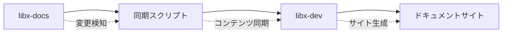
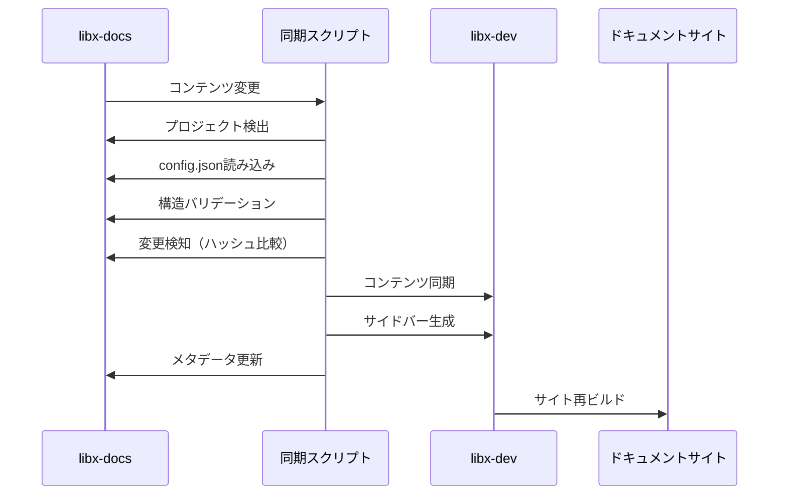

# libx-docs

libx-docsは、[libx-dev](https://github.com/libx-dev/libx-dev) プロジェクトのドキュメントサイト用コンテンツを管理するための専用リポジトリです。このリポジトリで管理されているマークダウンファイルとメタデータは、libx-devの自動同期システムによって定期的にドキュメントサイトに反映されます。

## 概要

### libx-devとの関係



- **libx-docs**: ドキュメントのソースコンテンツとメタデータを管理
- **libx-dev**: ドキュメントサイトのビルドとホスティング
- **同期システム**: 変更検知と自動的なコンテンツ転送

### 主な機能

- 📝 **マルチ言語対応**: 複数言語でのドキュメント作成と管理
- 🔄 **バージョン管理**: 複数バージョンの並行保守
- 🚀 **自動同期**: libx-devへの自動的なコンテンツ同期
- 🎯 **構造検証**: ディレクトリ構造とコンテンツの整合性チェック
- 📊 **メタデータ管理**: プロジェクト設定とカテゴリの一元管理

## ディレクトリ構造とファイル規則

### 標準ディレクトリ構造

libx-docsリポジトリは以下の構造に従って組織されています：

```
libx-docs/
├── [プロジェクト名]/           # 各ドキュメントプロジェクト
│   ├── config.json            # プロジェクト設定ファイル
│   ├── v1/                    # バージョンディレクトリ
│   │   ├── en/               # 言語ディレクトリ
│   │   │   ├── 01-guide/     # カテゴリディレクトリ（番号付き）
│   │   │   │   ├── 01-getting-started.mdx
│   │   │   │   └── 02-installation.mdx
│   │   │   └── 02-reference/
│   │   │       └── 01-api.mdx
│   │   └── ja/               # 日本語版
│   │       ├── 01-guide/
│   │       └── 02-reference/
│   └── v2/                   # 新バージョン
│       ├── en/
│       └── ja/
├── sample-docs/              # サンプルプロジェクト
├── demo/                     # デモプロジェクト
└── test-verification/        # テスト検証用プロジェクト
```

### ファイルとディレクトリの命名規則

#### プロジェクト名
- **形式**: 小文字のアルファベット、数字、ハイフンのみ使用可能
- **例**: `my-project`, `api-docs`, `user-guide`
- **禁止**: 大文字、アンダースコア、スペース

#### バージョンディレクトリ
- **形式**: `v[数字]`
- **例**: `v1`, `v2`, `v10`
- **必須**: 少なくとも1つのバージョンが必要

#### 言語ディレクトリ
- **形式**: ISO 639-1言語コード（2文字）
- **例**: `en` (英語), `ja` (日本語), `ko` (韓国語), `fr` (フランス語)
- **必須**: デフォルト言語を含む少なくとも1つの言語が必要

#### カテゴリディレクトリ
- **形式**: `[番号]-[カテゴリ名]`
- **番号**: 2桁の数字（01, 02, 03...）
- **例**: `01-guide`, `02-components`, `03-advanced`, `04-reference`
- **目的**: 表示順序を制御

#### ドキュメントファイル
- **形式**: `[番号]-[ファイル名].mdx`
- **番号**: 2桁の数字（01, 02, 03...）
- **拡張子**: `.mdx` 必須
- **例**: `01-getting-started.mdx`, `02-installation.mdx`

### 除外されるディレクトリとファイル

以下のディレクトリとファイルは同期対象から除外されます：

- `.` で始まるディレクトリ・ファイル（`.git`, `.gitignore`など）
- `_` で始まるディレクトリ・ファイル（`_drafts`, `_temp`など）
- `node_modules/`
- `dist/`, `build/`
- 一時ファイル（`.tmp`, `.bak`など）

### ディレクトリ構造の要件

#### 必須要素
- 各プロジェクトにconfig.jsonファイル
- 少なくとも1つのバージョンディレクトリ
- 少なくとも1つの言語ディレクトリ
- 各言語に同一のカテゴリ構造

#### 整合性チェック
同期システムは以下をチェックします：

1. **構造整合性**: 全言語で同じカテゴリ構造
2. **ファイル対応**: 各言語で対応するドキュメントファイル
3. **命名規則**: ファイル・ディレクトリ名のフォーマット
4. **メタデータ**: config.jsonの妥当性

## config.json設定ファイル

各プロジェクトのルートディレクトリには、プロジェクトのメタデータと設定を定義する`config.json`ファイルが必要です。

### 基本構造

```json
{
  "projectName": "my-project",
  "displayName": {
    "en": "My Project",
    "ja": "マイプロジェクト"
  },
  "description": {
    "en": "This is my project description",
    "ja": "これは私のプロジェクトの説明です"
  },
  "supportedLangs": ["en", "ja"],
  "defaultLang": "en",
  "versions": ["v1", "v2"],
  "latestVersion": "v2",
  "categories": {
    "guide": {
      "en": "Guide",
      "ja": "ガイド"
    },
    "reference": {
      "en": "Reference",
      "ja": "リファレンス"
    }
  },
  "icon": "file-text",
  "tags": ["documentation", "guide"],
  "baseUrl": "/docs/my-project",
  "repository": "https://github.com/username/my-project",
  "lastUpdated": "2025-09-03T15:00:00.000Z",
  "syncMetadata": {
    "lastSyncCommit": "abc123",
    "lastSyncTime": "2025-09-03T15:00:00.000Z",
    "contentHash": "def456"
  }
}
```

### 必須フィールド

#### `projectName` (string, 必須)
- プロジェクトの一意識別子
- ディレクトリ名と一致する必要がある
- 形式: `^[a-z0-9-]+$` (小文字、数字、ハイフンのみ)

#### `displayName` (object, 必須)
- 各言語でのプロジェクト表示名
- キー: 言語コード（例: "en", "ja"）
- 値: その言語での表示名

#### `description` (object, 必須)
- 各言語でのプロジェクト説明文
- キー: 言語コード
- 値: その言語での説明文

#### `supportedLangs` (array, 必須)
- サポートされている言語コードのリスト
- 形式: ISO 639-1言語コード（2文字）
- 例: `["en", "ja", "ko"]`

#### `defaultLang` (string, 必須)
- デフォルトの言語コード
- `supportedLangs`に含まれている必要がある

#### `versions` (array, 必須)
- 利用可能なバージョンのリスト
- 形式: `^v[0-9]+$` (例: "v1", "v2")
- 少なくとも1つのバージョンが必要

#### `latestVersion` (string, 必須)
- 最新バージョンの指定
- `versions`に含まれている必要がある

#### `categories` (object, 必須)
- カテゴリの翻訳マッピング
- キー: カテゴリID（ディレクトリ名から番号を除いたもの）
- 値: 各言語での翻訳オブジェクト

#### `baseUrl` (string, 必須)
- ドキュメントサイトでのベースURL
- 形式: `^/docs/[a-z0-9-]+$`
- 例: `/docs/my-project`

### 任意フィールド

#### `icon` (string, 任意)
- プロジェクトアイコン名
- デフォルト: `"file-text"`
- 利用可能なアイコンについては、libx-devのアイコンライブラリを参照

#### `tags` (array, 任意)
- プロジェクトタグ
- デフォルト: `["documentation"]`
- 検索とフィルタリングに使用

#### `repository` (string, 任意)
- ソースリポジトリのURL
- 形式: 有効なURI

#### `lastUpdated` (string, 自動設定)
- 最終更新日時
- 形式: ISO 8601日時形式
- 同期スクリプトによって自動設定

#### `syncMetadata` (object, 自動設定)
同期システムが管理するメタデータ：

- `lastSyncCommit`: 最後に同期したコミットハッシュ
- `lastSyncTime`: 最終同期日時
- `contentHash`: コンテンツ変更検知用ハッシュ値

### 設定ファイルのバリデーション

同期システムは[JSONスキーマ](../libx-dev/scripts/schemas/libx-docs-config.schema.json)を使用してconfig.jsonを検証します。主なバリデーションルール：

1. **必須フィールド**: すべての必須フィールドが存在すること
2. **形式チェック**: 各フィールドが正しい形式であること
3. **整合性チェック**:
   - `defaultLang`が`supportedLangs`に含まれること
   - `latestVersion`が`versions`に含まれること
   - `displayName`と`description`が全サポート言語を含むこと

## 自動同期システム

libx-docsのコンテンツは、libx-devの自動同期スクリプトによってドキュメントサイトに反映されます。

### 同期プロセスの概要



### 同期の実行方法

#### 全プロジェクト同期

```bash
# libx-devディレクトリから実行
node scripts/sync-content.js
```

#### 特定プロジェクトの同期

```bash
# sample-docsプロジェクトのみ同期
node scripts/sync-content.js sample-docs
```

#### バリデーションのみ実行

```bash
# エラーチェックのみ、実際の同期は行わない
node scripts/sync-content.js --validate-only
```

#### 強制同期

```bash
# 変更検知を無視して強制同期
node scripts/sync-content.js --force
```

### 変更検知メカニズム

同期システムは効率化のため、変更があったプロジェクトのみを同期します：

1. **コンテンツハッシュ**: ディレクトリ全体のMD5ハッシュを計算
2. **コミットハッシュ**: 最後の同期時のGitコミットと比較
3. **メタデータ比較**: `syncMetadata`フィールドで変更を検知

#### 同期対象となる変更

- MDXファイルの内容変更
- config.jsonの更新
- ディレクトリ構造の変更
- ファイルの追加・削除・リネーム

#### 同期対象外となる要素

- `.`や`_`で始まるファイル・ディレクトリ
- `node_modules/`, `dist/`, `build/`ディレクトリ
- 一時ファイル（`.tmp`, `.bak`など）

### 同期処理の詳細

#### 1. プロジェクト発見
- libx-docsディレクトリをスキャン
- `config.json`を持つディレクトリをプロジェクトとして認識

#### 2. 設定検証
- config.jsonのスキーマ検証
- ディレクトリ構造の整合性チェック
- 必須ファイルの存在確認

#### 3. 変更検知
- コンテンツハッシュの計算と比較
- 前回同期時からの変更を特定

#### 4. コンテンツ同期
- MDXファイルのlibx-devへのコピー
- アセットファイル（画像など）の同期
- メタデータの更新

#### 5. サイドバー生成
- ディレクトリ構造からナビゲーション生成
- 多言語対応サイドバーJSONファイル作成
- カテゴリ順序の適用

#### 6. メタデータ更新
- `syncMetadata`フィールドの更新
- 最終同期時刻とコミットハッシュの記録

## エラーパターンとトラブルシューティング

同期処理中に発生する一般的なエラーと対処法について説明します。

### 構造関連エラー

#### エラー: "Directory structure mismatch between languages"

**原因**: 言語間でディレクトリ構造が一致していない

**例**:
```
en/01-guide/01-getting-started.mdx ✓
ja/01-guide/                        ✗ (01-getting-started.mdx が存在しない)
```

**解決方法**:
1. 全ての言語で同一のディレクトリ構造を維持
2. 対応するMDXファイルをすべての言語で作成
3. ファイル名の番号接頭辞を統一

#### エラー: "Invalid file naming convention"

**原因**: ファイル名が命名規則に従っていない

**不適切な例**:
```
getting-started.mdx        ✗ (番号接頭辞なし)
1-guide.mdx               ✗ (1桁の番号)
01_guide.mdx              ✗ (アンダースコア使用)
```

**適切な例**:
```
01-getting-started.mdx    ✓
02-installation.mdx       ✓
03-configuration.mdx      ✓
```

**解決方法**:
1. すべてのMDXファイルに2桁の番号接頭辞を追加
2. ハイフンを使用してファイル名を区切る
3. 小文字を使用

### 設定ファイル関連エラー

#### エラー: "Config validation failed"

**原因**: config.jsonが必須フィールドを満たしていない、または形式が不正

**一般的な問題**:
1. **必須フィールドの不足**
   ```json
   {
     "projectName": "my-project"
     // displayName, description などが不足
   }
   ```

2. **言語設定の不整合**
   ```json
   {
     "supportedLangs": ["en", "ja"],
     "defaultLang": "ko"  // サポート言語に含まれていない
   }
   ```

3. **バージョン設定の不整合**
   ```json
   {
     "versions": ["v1", "v2"],
     "latestVersion": "v3"  // versions に含まれていない
   }
   ```

**解決方法**:
1. [設定スキーマ](../libx-dev/scripts/schemas/libx-docs-config.schema.json)と照らし合わせる
2. 必須フィールドをすべて含める
3. 整合性を確認（defaultLangがsupportedLangsに含まれるなど）

#### エラー: "Missing translation for language"

**原因**: displayNameやdescriptionで一部の言語の翻訳が不足

**問題のある設定**:
```json
{
  "supportedLangs": ["en", "ja", "ko"],
  "displayName": {
    "en": "My Project",
    "ja": "マイプロジェクト"
    // "ko" の翻訳が不足
  }
}
```

**解決方法**:
全てのサポート言語に対して翻訳を提供

### 同期処理エラー

#### エラー: "Sync failed - libx-dev directory not found"

**原因**: libx-devディレクトリが隣接ディレクトリに存在しない

**解決方法**:
1. libx-docsとlibx-devが同じ親ディレクトリにあることを確認
2. ディレクトリ構造を以下のように調整:
   ```
   parent/
   ├── libx-docs/
   └── libx-dev/
   ```

#### エラー: "Permission denied"

**原因**: ファイルやディレクトリの書き込み権限がない

**解決方法**:
1. libx-devディレクトリの権限を確認
2. 必要に応じて権限を変更: `chmod -R 755 ../libx-dev/`

#### エラー: "Content hash mismatch"

**原因**: コンテンツハッシュの計算でエラーが発生

**解決方法**:
1. `--force` オプションで強制同期を実行
2. 一時ファイルや隠しファイルが含まれていないかチェック

### デバッグとバリデーション

#### バリデーションの実行

問題を特定するために、まずバリデーションのみを実行：

```bash
node scripts/sync-content.js --validate-only
```

#### 詳細なエラー情報

特定のプロジェクトで詳細なログを確認：

```bash
DEBUG=1 node scripts/sync-content.js my-project
```

#### よくある解決手順

1. **構造の確認**
   ```bash
   # ディレクトリ構造を確認
   tree my-project/ -a
   ```

2. **config.jsonの検証**
   ```bash
   # JSONの構文チェック
   cat my-project/config.json | jq .
   ```

3. **権限の確認**
   ```bash
   # ファイル権限を確認
   ls -la my-project/
   ```

4. **強制再同期**
   ```bash
   # 問題が解決しない場合の最終手段
   node scripts/sync-content.js my-project --force
   ```

## サンプルプロジェクトと実例

リポジトリには、異なる用途とパターンを示すサンプルプロジェクトが含まれています。

### 利用可能なサンプル

#### 1. `demo/` - 基本的なプロジェクト

**特徴**:
- シンプルな2言語対応（英語・日本語）
- 1つのバージョン（v1）
- 基本的なカテゴリ構造

**構造**:
```
demo/
├── config.json
└── v1/
    ├── en/
    │   ├── 01-guide/
    │   │   └── 01-tutorial.mdx
    │   └── 02-reference/
    │       └── 01-api.mdx
    └── ja/
        ├── 01-guide/
        │   └── 01-tutorial.mdx
        └── 02-reference/
            └── 01-api.mdx
```

**設定例**:
```json
{
  "projectName": "demo",
  "displayName": {
    "en": "Demo Project",
    "ja": "でもプロジェクト"
  },
  "supportedLangs": ["en", "ja"],
  "defaultLang": "en",
  "versions": ["v1"],
  "latestVersion": "v1",
  "categories": {
    "guide": {
      "en": "Guide", 
      "ja": "ガイド"
    }
  }
}
```

#### 2. `sample-docs/` - 包括的なドキュメント

**特徴**:
- 2言語対応（英語・日本語）
- 複数バージョン（v1、v2）
- 豊富なカテゴリとコンテンツ
- 実用的なドキュメント例

**構造**:
```
sample-docs/
├── config.json
├── v1/
│   ├── en/
│   │   └── 01-guide/
│   │       └── 01-getting-started.mdx
│   └── ja/
│       └── 01-guide/
│           └── 01-getting-started.mdx
└── v2/
    ├── en/
    │   ├── 01-guide/
    │   │   ├── 01-getting-started.mdx
    │   │   ├── 02-creating-documents.mdx
    │   │   ├── 03-editing-documents.mdx
    │   │   ├── 04-organizing-content.mdx
    │   │   └── 05-version-management.mdx
    │   ├── 02-components/
    │   │   ├── 01-overview.mdx
    │   │   ├── 02-icons.mdx
    │   │   ├── 03-tabs.mdx
    │   │   └── 04-sidebar-generation.mdx
    │   ├── 03-advanced/
    │   │   ├── 01-customization.mdx
    │   │   ├── 02-automation.mdx
    │   │   └── 03-deployment.mdx
    │   └── 04-reference/
    │       └── 01-frontmatter.mdx
    └── ja/
        └── [同様の構造]
```

#### 3. `test-verification/` - テスト・検証用

**特徴**:
- 3言語対応（英語・日本語・韓国語）
- 複数バージョン（v1、v2）
- 同期システムのテスト用
- エッジケースの検証

**設定の特徴**:
```json
{
  "supportedLangs": ["en", "ja", "ko"],
  "categories": {
    "guide": {
      "en": "Guide",
      "ja": "ガイド", 
      "ko": "가이드"
    },
    "troubleshooting": {
      "en": "Troubleshooting",
      "ja": "トラブルシューティング",
      "ko": "문제 해결"
    }
  }
}
```

### 新しいプロジェクトの作成手順

#### ステップ1: ディレクトリ構造の作成

```bash
mkdir my-project
cd my-project

# 基本構造を作成
mkdir -p v1/en/01-guide
mkdir -p v1/ja/01-guide
```

#### ステップ2: config.json の作成

```json
{
  "projectName": "my-project",
  "displayName": {
    "en": "My Project",
    "ja": "私のプロジェクト"
  },
  "description": {
    "en": "This is my project description",
    "ja": "これは私のプロジェクトの説明です"
  },
  "supportedLangs": ["en", "ja"],
  "defaultLang": "en",
  "versions": ["v1"],
  "latestVersion": "v1",
  "categories": {
    "guide": {
      "en": "Guide",
      "ja": "ガイド"
    }
  },
  "icon": "file-text",
  "tags": ["documentation"],
  "baseUrl": "/docs/my-project"
}
```

#### ステップ3: 最初のドキュメントファイル作成

英語版 (`v1/en/01-guide/01-getting-started.mdx`):
```mdx
---
title: "Getting Started"
description: "Learn the basics of using this project"
---

# Getting Started

Welcome to my project! This guide will help you get started.

## Prerequisites

- Node.js 18+
- Basic understanding of Markdown

## Installation

Follow these steps to install the project...
```

日本語版 (`v1/ja/01-guide/01-getting-started.mdx`):
```mdx
---
title: "はじめに"
description: "このプロジェクトの基本的な使い方を学ぶ"
---

# はじめに

私のプロジェクトへようこそ！このガイドでは始め方を説明します。

## 前提条件

- Node.js 18+
- Markdownの基本的な理解

## インストール

以下の手順でプロジェクトをインストールします...
```

#### ステップ4: 同期の実行

```bash
# libx-devディレクトリから実行
cd ../libx-dev
node scripts/sync-content.js my-project
```

### 参考になるファイル

プロジェクト作成時に参考にすべきファイル：

- **基本設定**: `demo/config.json`
- **包括的な設定**: `sample-docs/config.json`
- **多言語設定**: `test-verification/config.json`
- **フロントマター例**: `sample-docs/v2/*/04-reference/01-frontmatter.mdx`
- **コンテンツ構成例**: `sample-docs/v2/*/01-guide/04-organizing-content.mdx`

## コンテンツ作成のベストプラクティス

高品質なドキュメントを作成するためのガイドラインと推奨事項です。

### MDXファイルの構造

#### 1. フロントマター（必須）

すべてのMDXファイルは以下のフロントマターから始める：

```mdx
---
title: "ドキュメントのタイトル"
description: "簡潔な説明文（検索とSEOに使用）"
---
```

#### 2. 見出し階層

一貫した見出し構造を維持：

```mdx
# メインタイトル（H1 - ページごとに1つ）

## 主要セクション（H2）

### サブセクション（H3）

#### 詳細項目（H4）
```

#### 3. 内容構成の推奨パターン

```mdx
---
title: "機能名 / 操作名"
description: "この機能の概要説明"
---

# 機能名 / 操作名

この機能の目的と概要を簡潔に説明。

## 概要

基本的な理解のために必要な背景情報。

## 前提条件

この機能を使用するために必要な条件：

- 必要なソフトウェア
- 前提知識
- 準備すべき環境

## 基本的な使用方法

ステップバイステップの説明：

1. 最初のステップ
2. 次のステップ
3. 最終ステップ

## 高度な使用方法

より複雑なユースケース（任意）。

## 注意点

重要な警告や制限事項。

## 関連項目

- [関連するドキュメント](./02-related-topic.mdx)
- [参考資料](../reference/01-api.mdx)
```

### 多言語対応のベストプラクティス

#### 1. 内容の一致

- すべての言語で同じ情報量を提供
- 文化的な違いを考慮した適切な説明
- 技術用語の統一

#### 2. リンク管理

言語間でのリンクは言語コードを含める：

```mdx
<!-- 英語版から日本語版へ -->
[日本語版で読む](/ja/v2/guide/getting-started)

<!-- 日本語版から英語版へ -->
[Read in English](/en/v2/guide/getting-started)
```

#### 3. ファイル名の統一

同一コンテンツは言語に関係なく同じファイル名を使用：

```
en/01-guide/01-getting-started.mdx
ja/01-guide/01-getting-started.mdx
ko/01-guide/01-getting-started.mdx
```

### コンテンツ品質ガイドライン

#### 1. 明確さと簡潔性

- 1つの段落につき1つの概念
- 短く、理解しやすい文章
- 専門用語には説明を付ける

#### 2. 実用性の重視

- 実際のコード例を含める
- ユーザーが直面する実際の問題を解決
- 段階的な手順を提供

#### 3. メンテナンス性

- 日付に依存する情報は避ける
- 外部リソースへの依存を最小化
- 定期的な更新を前提とした内容構成

### コードとサンプルの記述

#### 1. コードブロック

言語を指定し、実行可能なサンプルを提供：

```mdx
```javascript
// 実行可能な完全なサンプル
const config = {
  projectName: "my-project",
  defaultLang: "en"
};
\```
```

#### 2. 設定例

実際に動作する設定を示す：

```mdx
```json
{
  "projectName": "example-project",
  "displayName": {
    "en": "Example Project",
    "ja": "サンプルプロジェクト"
  }
}
\```
```

#### 3. コマンド例

実行環境を明記：

```mdx
```bash
# libx-devディレクトリから実行
node scripts/sync-content.js my-project
\```
```

### 文書間の連携

#### 1. 適切なクロスリファレンス

```mdx
詳細な設定方法については[設定ガイド](../advanced/configuration.mdx)を参照してください。
```

#### 2. 段階的な学習パス

```mdx
## 次のステップ

基本を理解したら、以下に進んでください：

1. [高度な機能](../advanced/advanced-features.mdx)
2. [トラブルシューティング](../troubleshooting/common-issues.mdx)
3. [デプロイメント](../deployment/getting-started.mdx)
```

### バージョン管理戦略

#### 1. 下位互換性の維持

新しいバージョンでは：
- 古いバージョンの情報も保持
- 移行ガイドを提供
- 変更点を明確に説明

#### 2. バージョン間の整合性

```mdx
> **注意**: この機能はv2で追加されました。v1を使用している場合は[v1ドキュメント](/v1/guide/alternative-method.mdx)を参照してください。
```

### 品質チェックリスト

新しいコンテンツを追加する前の確認事項：

- [ ] **構造**: 適切な見出し階層とセクション分け
- [ ] **フロントマター**: title と description が適切に設定
- [ ] **多言語**: すべてのサポート言語で対応ファイルが存在
- [ ] **リンク**: 内部リンクが正しく動作
- [ ] **コード**: サンプルコードが実行可能で正確
- [ ] **整合性**: 他のドキュメントとの情報の一致
- [ ] **アクセシビリティ**: 見出しとリストの適切な使用

## 貢献とサポート

### 貢献方法

1. **Issue作成**: バグ報告や改善提案
2. **Pull Request**: ドキュメントの修正や追加
3. **翻訳**: 新しい言語版の作成

### 連絡先

プロジェクトに関する質問や提案は、[libx-dev](https://github.com/libx-dev/libx-dev) リポジトリのIssuesで受け付けています。
